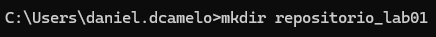
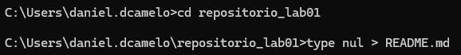
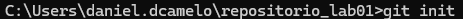
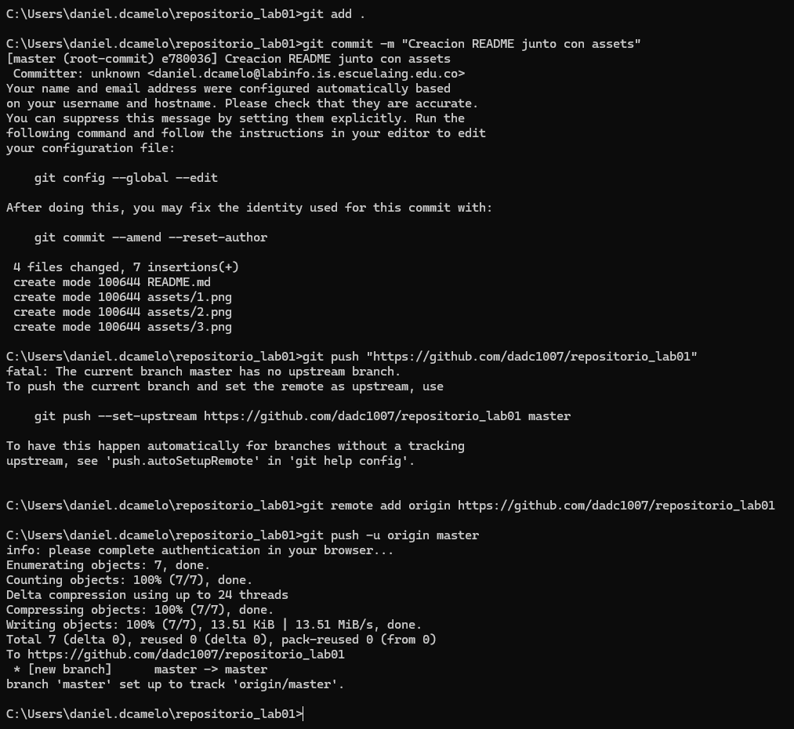
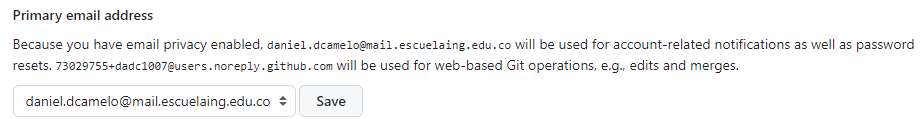
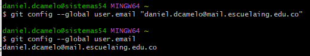

Pasos:
1. Abrir cmd.
2. Creo la carpeta del repositorio.

3. Creo el archivo README.

4. Investigue los comandos git add y git commit.

5. Cree el repositorio en github.

6. Configuro el repositorio local en el remoto.

7. Configuro el correo en git local de manera correcta.

8. creo una carpetapara subir las imagenes al git.

